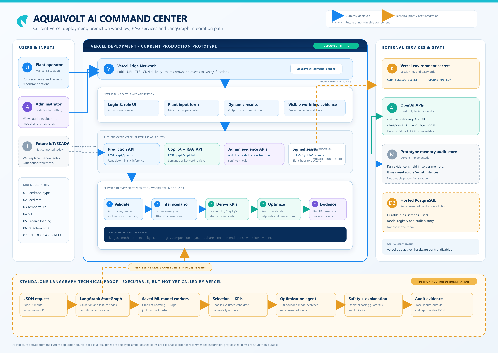
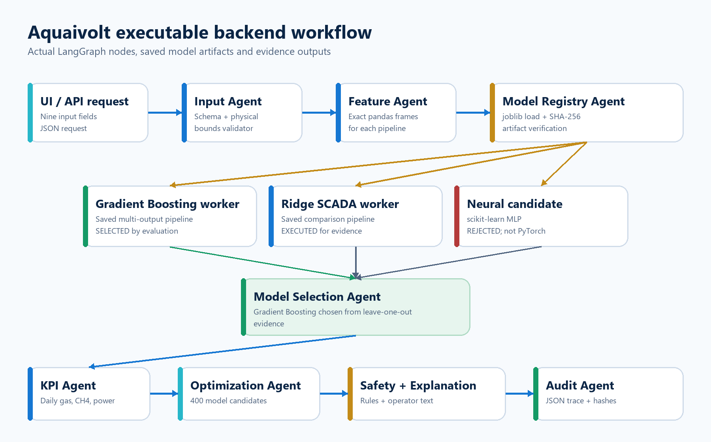

# Aquaivolt AI Biogas Command Center

[](https://github.com/Rohit45-0/Biogas-prod/actions/workflows/verify-ai-workflow.yml)

This repository contains the Aquaivolt biogas dashboard, its server-side prediction logic, the executable LangGraph technical proof, saved machine-learning artifacts, model evaluation results and audit evidence.

**Live dashboard:** [aquaivolt-command-center.vercel.app](https://aquaivolt-command-center.vercel.app/)

## Client quick start (Windows)

Install Git, Node.js 22 or newer, and Python 3.12. Then open PowerShell and run only these two commands:

```powershell
git clone https://github.com/Rohit45-0/Biogas-prod.git; cd Biogas-prod
./START_AQUAIVOLT.bat
```

The first run opens `.env.local` in Notepad. Add `OPENAI_API_KEY` if semantic Copilot is needed, save, and close Notepad. The launcher then installs dependencies, executes the real saved-model/LangGraph proof, verifies repeatability, starts the dashboard, and opens [http://localhost:3000](http://localhost:3000).

For screenshots, login details, troubleshooting, and nontechnical instructions, use **[CLIENT_QUICK_START.md](CLIENT_QUICK_START.md)**.



## What happens when the user calculates production?

```text
Nine plant inputs
      ↓
Authentication and validation
      ↓
Multi-input scenario inference
      ↓
Biogas, methane, electricity and carbon calculations
      ↓
Setpoint search and recommendations
      ↓
Charts, explanation and auditable execution ID
```

The dashboard considers:

1. Feedstock type
2. Feed rate
3. Temperature
4. pH
5. Organic loading rate
6. Hydraulic retention time
7. COD input
8. VFA
9. Mixer speed

## Where is the AI/model code?

| Component | Location | Purpose |
|---|---|---|
| Deployed prediction API | [`app/api/predict/route.ts`](app/api/predict/route.ts) | Current deterministic TypeScript scenario model used by Vercel |
| LangGraph workflow | [`ai-workflow/src/aquaivolt_langgraph_backend.py`](ai-workflow/src/aquaivolt_langgraph_backend.py) | Executable nine-node technical workflow |
| Saved ML artifacts | [`ai-workflow/models`](ai-workflow/models) | Gradient Boosting and Ridge pipelines |
| Model comparison | [`ai-workflow/evaluation`](ai-workflow/evaluation) | Evaluation results and limitations |
| Reproducible evidence | [`ai-workflow/run-evidence/latest_run.json`](ai-workflow/run-evidence/latest_run.json) | Inputs, outputs, node trace and model hashes |
| Copilot RAG | [`app/api/copilot/route.ts`](app/api/copilot/route.ts) | Answers questions using project evidence and current scenario context |
| Technical document | [`docs/Aquaivolt_Backend_Technical_Evidence.docx`](docs/Aquaivolt_Backend_Technical_Evidence.docx) | Auditor-oriented explanation, code and evidence |

## LangGraph workflow

The Python workflow genuinely executes these nodes:

```text
START
  → Validate request
  → Engineer model features
  → Load and hash saved models
  → Run Gradient Boosting and Ridge
  → Select the evaluated candidate
  → Derive daily production metrics
  → Search 400 bounded operating scenarios
  → Add safety explanation
  → Persist JSON audit evidence
  → END
```



### Important implementation statement

- The **current Vercel endpoint** uses the server-side TypeScript scenario ensemble.
- The **LangGraph workflow** is an executable technical proof around saved scikit-learn models.
- LangGraph is not yet called by the deployed `/api/predict` endpoint. Connecting them is the next integration step.
- PyTorch is not used. A small scikit-learn neural-network candidate was evaluated and rejected because it overfit the small supplied dataset.
- The calculations are deterministic; the browser does not generate random prediction values.

## Run only the AI workflow on Windows

Install [Python 3.12](https://www.python.org/downloads/), download this repository and double-click:

```text
ai-workflow/RUN_AI_WORKFLOW.bat
```

The first run creates a local environment, installs the required libraries, executes the sample input and writes a new JSON file under `ai-workflow/run-evidence`.

Manual command:

```powershell
cd ai-workflow
python -m pip install -r requirements.txt
python src/aquaivolt_langgraph_backend.py --input sample_input.json --output-dir run-evidence
python tests/test_workflow.py
```

Expected reproducibility checks:

- Identical input returns identical model metrics.
- Gradient Boosting is selected from the saved comparison.
- The optimizer evaluates 400 bounded candidates.
- All nine workflow nodes appear in the trace.

## Run the dashboard locally

Install [Node.js 22](https://nodejs.org/), download this repository and double-click:

```text
START_DASHBOARD.bat
```

The launcher copies the local demo settings, installs packages and opens `http://localhost:3000`.

Demo accounts created from `.env.example`:

- Administrator: `admin` / `admin123`
- User: `user` / `user123`

The OpenAI API key is optional. Without it, Copilot uses the built-in keyword fallback. Never commit a real API key or deployment token.

## Model evaluation summary

On the ten supplied optimization anchors, Gradient Boosting produced the lowest saved aggregate leave-one-out error and was retained for the technical proof. The deployed scenario ensemble remained close and is easier to explain for the prototype dashboard. Full metrics are in [`COMPARISON_REPORT.md`](ai-workflow/evaluation/COMPARISON_REPORT.md).

The supplied workbooks are research-informed synthetic/scenario data. They are suitable for demonstrating the system but are not independent evidence of real-plant prediction accuracy. Production validation requires timestamped site measurements and an untouched test period.

## Presentation explanation

> The user submits nine plant parameters. The server validates them and runs deterministic model logic. The technical LangGraph proof loads two saved machine-learning pipelines, executes both, selects the evaluated model, derives biogas, methane and electricity metrics, searches 400 nearby scenarios and stores an auditable trace. The deployed dashboard currently uses the TypeScript scenario ensemble; the LangGraph workflow is the reproducible backend proof prepared for the next integration stage.

## Repository map

```text
app/                 Next.js dashboard and Vercel API routes
ai-workflow/         LangGraph code, models, tests and run evidence
docs/                Architecture diagram and technical evidence document
public/              Dashboard assets
tests/               Application verification tests
```

## Safety and limitations

This is a decision-support prototype. It does not read physical sensors or automatically operate valves, mixers, heaters or generators. All recommended changes require plant-operator review.
